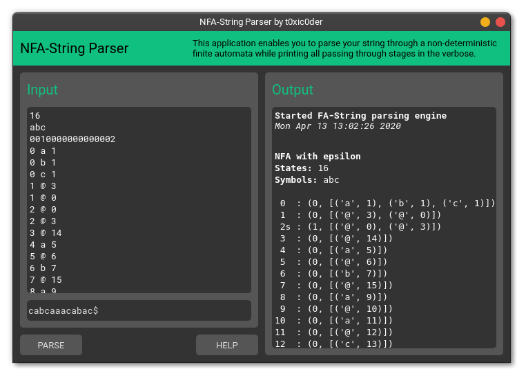
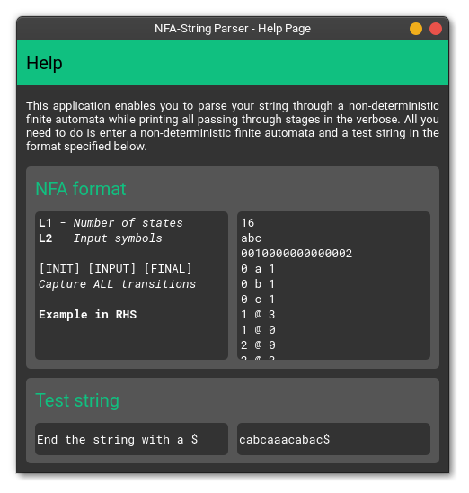

# nfa-string-parser
Parses a given string through a provided non-deterministic finite automata

## String parsing through the given NFA


## Dedicated help page for more information


## Usage 
1. Install and upgrade **virtualenv** if not already done by executing ```pip3 install virtualenv --user```
2. Clone the repository on your local drive and make it your current working directory
3. Create a virtual environment by executing ```virtualenv venv```
4. Activate the virtual environment by executing ```source venv/bin/activate```
5. Install all dependencies for the project by executing ```pip3 install -r requirements.txt```
6. Run the project by executing ```python3 IndexApplication.py```
7. Type in any non-deterministic finite automata and a test string - watch it get parsed
8. When done tinkering, deactivate the virtual environment by executing ```deactivate```
9. Give stars to the repository if it was helpful

## Bugs
1. Error detection and exception handling is currently broken.
2. Application crash may occur with unrecognizable input symbols.

## Contribute
Fork, add, build and make a PR. You know the drill.
